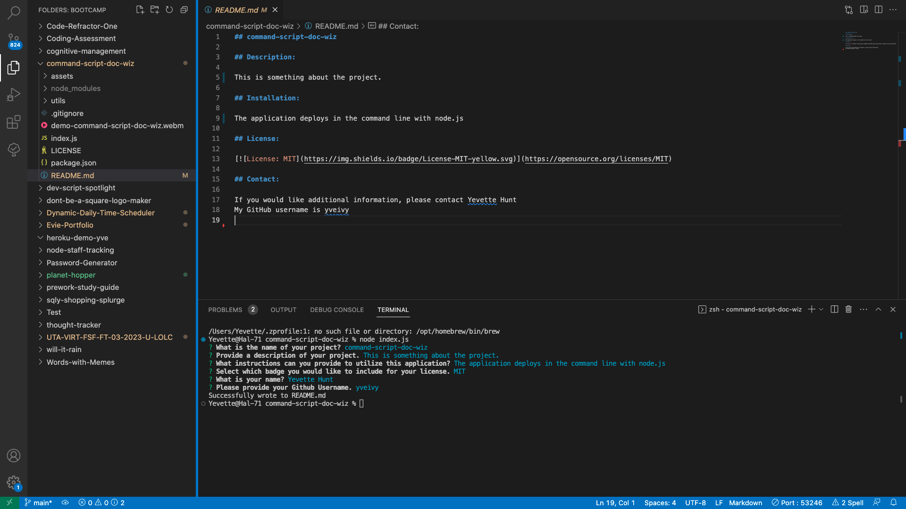

## command-script-doc-wiz

## Description:

This app provides a user-friendly command-line interface to interact with the user and gather project-specific information. The app presents a series of questions, and based on the user’s input, a README file is generated in a standardized format.The new file is saved to the project directory. This automated process of creating a README file simplifies the initial setup of a project and ensures that essential information is included.

## Installation:

To initialize this application, install Node.js and navigate to the project directory in your terminal. In your command prompt run the command node index.js. Follow the prompts and find your custom README.md file in your project directory after completion.

## License:

## Contact:

If you would like additional information, please contact Yevette Hunt,

 My GitHub username is yveivy

https://github.com/yveivy/command-script-doc-wiz/blob/main/demo-command-script-doc-wiz.webm
